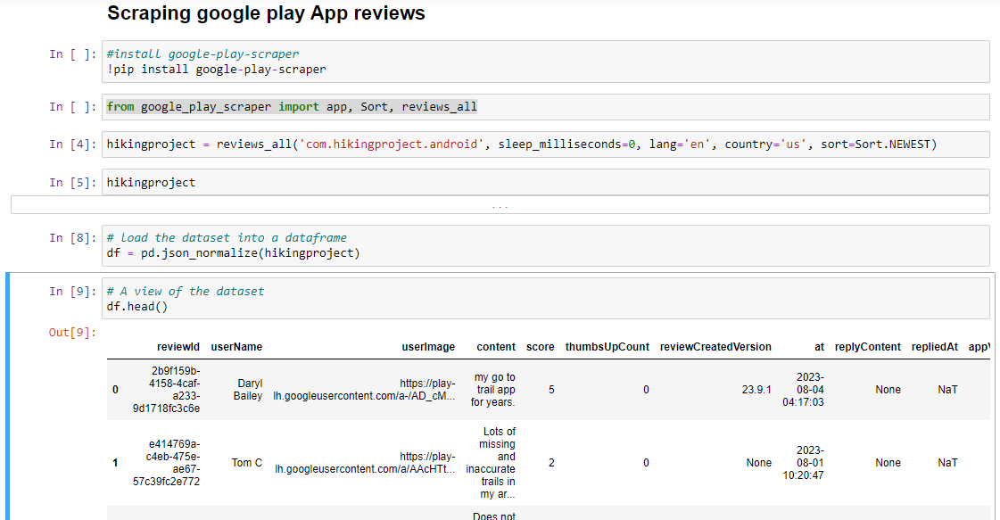
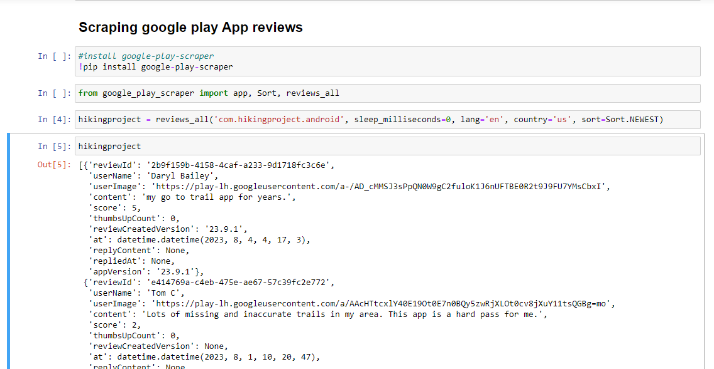

## Hiking Project App Review Sentiment Analysis

### Introduction
Welcome to the Hiking Project App Review Sentiment Analysis project! This repository contains the code and analysis for performing sentiment analysis on user reviews of the Hiking Project app. Hiking Project is a popular mobile application designed for outdoor enthusiasts and hikers to discover and plan their hiking adventures. Understanding user sentiments and feedback is crucial for app developers to enhance the user experience and address any issues or concerns.

### Problem Statement
The primary objective of this project is to analyze the sentiment of user reviews for the Hiking Project app. By conducting sentiment analysis, we aim to achieve the following goals:

Gain insights into user satisfaction and dissatisfaction with the app.
- Identify common issues or pain points raised by users.
- Evaluate how positive or negative sentiments have evolved over time.
- Provide actionable recommendations for app developers to improve the user experience.

Through this analysis, we aim to help the development team make data-driven decisions and prioritize areas for app enhancement, ultimately leading to a more user-friendly and enjoyable Hiking Project app.

### Data Source
To conduct this sentiment analysis, I gathered user reviews of the Hiking Project app from the following data source:

Google Play Store: I collected a dataset of user reviews from the Google Play Store using web scraping techniques. The dataset includes textual reviews, user ratings, and timestamps of when the reviews were posted.

The dataset obtained from the Google Play Store will serve as the foundation for our analysis. I have cleaned and processed the data to make it suitable for sentiment analysis. You can find the dataset used in this project in the 'data' directory of this repository.

Feel free to explore the code and analysis provided here, and please don't hesitate to reach out if you have any questions or suggestions.

### Conclusion
- 57.9% of the sentiment was **positive**, 13.8% was **Negative** and 28.24% was **Neatral**
- June happens to be the month user make use of the app most followed by november
- The major complain of the users were the app lags

